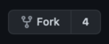

## Getting the project locally

- Fork the repo
<br>


- Clone the repo on your local machine

```
git clone <HTTP Clone> financify
```

You need to install:
- Java
- MySQL

Now to MySQL databases can be imported with MySQL workbench. This will add structure of tables as well as the sample data we are providing.