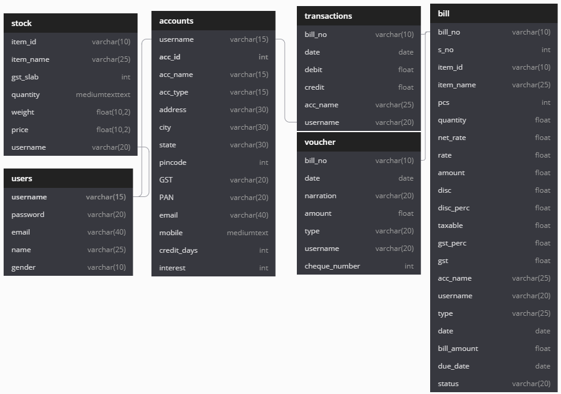

 

We are proposing an idea to make an accounting software using Java programming language and MySQL database. The desktop application will have a user-friendly UI and a database to keep track of all records.

 

# *Redefining Accounting*

*This readme file is being made to introduce and explain our project, *‘Financify’* to a large number of developers and users all around the globe. It contains the information regarding the full framework and the purpose of the project.*

**The whole project is based on Java programming language.The desktop application has a user-friendly UI and a very famous and stable database named MySQL to keep a track of all records.*’Financify’* is designed in such a way that it will meet the demands of a small scale business and as well as a large scale business.The implementation of the front-end for this project was done using Java Swing library for building the GUI of the software, along with this NetBeans IDE (Integrated Development Environment) and VS Code ( Code Editor ) are the tools which were used to compile all distinguished and vast frames of this project. Keeping all the bills and vouchers in an organised order is no more a hectic task,*’Financify’* makes it easy for you.**  
____

># **INDEX**
- [Frames and Description](#id-sec1)
- [ER Diagram](#id-sec2)
- [DB DIagram](#id-sec3)
- [Libraries](#id-sec4)
- [Installation Guide](#id-sec5)
- [Contributors](#id-sec6)

>## **FRAMES AND DESCRIPTION**

*In this section, the whole framework will be described in an elaborated and a sequential way which will help the users to know more about its working and functionality and any person will be able to use it with the utmost usability* -:
 
### 1.) Register Page:

 Now as the application is launched, the first window which appears in front of the user is the register page, which will ask the user to enter his/her respective details in order to complete the registration process and create a new account which will be used in the future. On completing the registration process, a pop up window appears which confirms that an account has been created successfully. The Register page comprises of various text fields and combo boxes which are:

- **Name:** Should not contain any digits or any other special characters (only alphabets).
- **Gender:** Users can choose the gender as per their choice.(combo box). (Mandatory field)
- **Username:** The users can keep the username according to their comfort but have to remember it as it will be asked at the time of logging in. The username has to be distinct for each account in order to avoid any ambiguities (Can contain alphanumeric characters as well as special symbols)
- **Email:** Can be upto 40 characters in length comprising of alphanumeric and special symbols (has to be in the format @xyz.com)(also has to be distinct for each account)
- **Password:** Contains alphanumeric characters, one upper case character and a special symbol. Length can be from 8 - 20 characters. ( cannot be the same for any user).
 At the end, there is a Jbutton for confirmation and creating the account and an option to directly go to the login page if an account already exists.

Regular Expression (Regex) was used in the backend code of this frame to ensure that the users enter the data according to the constraints provided above.

> Java Swing Components used:
- [x] JTextField
- [ ] JTextField
- [ ] JTextField
- [ ] JTextField
- [ ] JTextField
- [ ] JTextField
- [ ] ~~JTextField~~
- [ ] ~~JTextField~~ 
    
### 2.) Login Page:

It is the page through which a user successfully logs in to their respective account and can actually start using the software and it also comprises mainly of two text fields (just like any other ordinary login page) that is the Username and the Password with very same constraints for these two fields as they are in the case of the registration window. There is also an option that if the user does not have an existing account then they can come back to the registration page accordingly.

> Java Swing Components used:

- [x] JTextField
- [ ] JTextField
- [ ] JTextField
- [ ] JTextField
- [ ] JTextField
- [ ] JTextField
- [ ] JTextField
- [ ] JTextField 

### 3.)Main Frame:

After the user has successfully logged in, the main frame appears which showcases the summary and overview of some of the transactions and dues for the person’s account. There is a proper separate panel which has labels for all the necessary frames which include details such as Items, Ledger Accounts, Trial Balancing, Sale, Purchase and Voucher. By simply clicking on any of these above-mentioned labels, the user will be brought to a new window which will show all the required account details for the respective label which was clicked by the user. A table with proper columns for Bill No., Account Name, Due Date and Amount is present in the frame for the user to get a summary. Similarly, a graphical representation has also been provided to get an overview of the account and the transactions made so far which is organised well on the basis of segregating the amount for each and every month. The user will also have options for signing out of their account as well as for making an exit from the application.

### 4.)Items: 

 This frame is made to enter and edit details related to the items which the user wants to keep the record of. The user can simply view and edit the details of the existing items, add new items and can even delete items and their details according to their desire. The exit button is present for the user. By clicking on it, the user will be brought back to the main frame window.

### 5.) Ledger Accounts:

 As the name suggests, this frame is a complete receptacle and a display to all your details and transactions which are ongoing in your firm. The ledger accounts frame consists many options to assist you in keeping a proper and organised record of all your transactions.

- **Setting of Date and Time Period of Transactions:** 
There is an option provided in the software which helps the user to set the date (from and till) you want to know transactions from. Checkboxes are provided to directly select the time period on a daily, monthly and quarterly basis which makes it easier for the user to retrieve the required data from the records.

- **Transaction Table:**

 It shows the serial number, particulars, exact date of billing/transaction, amount and type( credit or debit) which can also be downloaded in excel format by the user.

- **Net Balance Display:**

 
These boxes show the net balance, amount credited and debited in the account of the particular person you want to see.At the end, the user can move to the account setup frame or exit the current frame according to their choice

- **Account Setup :** This frame allows the user to create a new account, edit it or delete an account according to the user’s discretion. It contains options/text fields to enter/store/display details related to a person such as their ID, Name, Type, Address, State,Pincode,Email,GST and many other details related to banking.
At the end, there are buttons for the above tasks which one can perform in the frame or exit the frame if they want. 
> Java Swing Components used:

- [x] JTextField
- [ ] JTextField
- [ ] JTextField
- [ ] JTextField
- [ ] JTextField
- [ ] JTextField
- [ ] JTextField
- [ ] JTextField 

### 6.)Trial Balancing-Closing: 

Trial Balance has a tabular format which shows details of all ledgers balances at one place. It includes transactions done as well along with the opening and closing balances of ledgers, as every entity needs to evaluate its financial position over a particular span of time. The trial balance shows the list of all the accounts with both debit as well as credit balance at one place and helps in analyzing the position and transactions entered during such time period at one place. In this frame, one can directly go through all the ongoing transactions(credit or debit) in the firm. Trial Balancing frame consists of a table which has the following components-:

- Account name
- City
- Debit
- Credit
- Annexure Head

At the bottom of the frame there are three *JTextFields* to show the net credit and debit along with the total balance present on a real time basis.<p.>

> Java Swing Components used:
- [x] JTextField
- [ ] JTextField
- [ ] JTextField
- [ ] JTextField
- [ ] JTextField
- [ ] JTextField
- [ ] ~~JTextField~~
- [ ] ~~JTextField~~ 

### 7.) Sale:
 
The sale frame is one of the most important and of the utmost utility amongst all the frames. One can update and edit item details and enter various valuable data in this frame. Starting from the top, this frame allows the user to enter various details about the buyer/consumer/customer such as the Bill number, Bill Date, Due date, Mode of Payment(cash/credit/cheque), Balance , GST Number and address. Also there is a dropbox provided to choose between the  names of customers which were pre-registered. Now, the main part comes from the table. The table in the frame is the part where you can add items and can calculate some very important quantities like the net amount, discount etc. It consists of the following details:-

- *Item Id*
- *Item name*
- *Pieces*
- *Quantity(kg)*
- *Rate*
- *Net Rate*
- *Amount*
- *Discount*
- *Disc (%)*
- *Taxable*
- *GST(%)*
- *GST8*

After doing all this, the user can click on the generate bill button after which, a bill will be generated that will showcase the calculated CGST, SGST, Rate, Amount and Subtotal in certain TextFields which will prove to be quite beneficial for the user as all essential details will get listed in a very organized way. The user can then exit according to their choice.

> Java Swing Components used:
- [x] JTextField
- [ ] JTextField
- [ ] JTextField
- [ ] JTextField
- [ ] JTextField
- [ ] JTextField
- [ ] ~~JTextField~~
- [ ] ~~JTextField~~ 

### 8.) Purchase:

A Purchase Invoice is a bill which the company or the firm receives from their suppliers against which the respective firm needs to make the payment. Purchase Invoice is the exact opposite of the Sales Invoice. Here the firm has to accrue expenses to their suppliers.
 Making a Purchase Invoice is very similar to making a Purchase Order. Once the user goes to our Purchase frame, he/she will have an option to select the supplier from a given ComboBox and then click on the details button after which the user will get all the necessary details of the supplier such as the bill date, due date, balance, etc. Now the user can add items and quantities in the Items table. After doing all this, the user can click on the generate bill button after which, a bill will be generated that will showcase the calculated CGST, SGST, Rate, Amount and Subtotal in certain TextFields which will prove to be quite beneficial for the user as all essential details will get listed in a very organized way. After clicking on the exit button, the user will get back to the main frame.

> Java Swing Components used:
- [x] JTextField
- [ ] JTextField
- [ ] JTextField
- [ ] JTextField
- [ ] JTextField
- [ ] JTextField
- [ ] ~~JTextField~~
- [ ] ~~JTextField~~ 

### 9.) Voucher:

A voucher is a supporting document which the company uses to create and file all supporting documents required for approving a voucher. Vouchers help in recording all transactions and make sure that their respective payment is made in an authorized manner and that the purchased goods and services are actually and properly received by the company.
 A purchase voucher is created upon receiving the supplier’s invoice. When payment is made to the supplier, the voucher is stamped as “paid” and then archived with its supporting documents. Purchase vouchers are not created without receiving supplier’s invoices. They are also not used in the process of payroll payment. If vouchers are used for every payable then the total amount of all payables can be aggregated and the total amount of outstanding accounts payable can be determined. However, this function is only needed in the manual accounting system. The computerized accounting system instead uses the aged payables report.
 Vouchers are also known as ‘source documents’ because they help identify a transaction’s source. Some of its examples include cash memo, cheque, bill receipt, pay-in-slip, debit note, credit note, invoice, etc.

> Java Swing Components used:
- [x] JTextField
- [ ] JTextField
- [ ] JTextField
- [ ] JTextField
- [ ] JTextField
- [ ] JTextField
- [ ] ~~JTextField~~
- [ ] ~~JTextField~~ 

### 10.) Analysis Dashboard:

 Now when it comes down to our very last frame, it is all about the final representation of all the different transactions made so far.
 We have used graphical representation for showcasing all the data. Below the graph, the user will find four proper and well defined labels which will mention the sales made by the firm under the Sale section, amount which the firm needs to clear under the Purchase section, the amount which is due comes under the Sales Unrealized, and the total GST formed from the Sales made by the firm comes under the GST section. And as usual, an exit button has been provided which will get the user back to our main frame.

___

 

> ## **ER Diagram**
Below given is an ER (Entity Relationship) diagram which will help the users to know more abut the software in an interactive manner.

>## **DB Diagram**

*A DB Diagram is a Graphical representation  of structure of the database.* Below given is a DB Diagram related to **Financify**.

>## Libraries
*The libraries used in the creation of this software were:*

1. **Animation Class**
2. **Apache POI**
3. **jCalendar**
4. **jFreeChart**
5. **AutoCompleteDecorator**
6. **java.sql**
7. **Java.util.logging**
8. **Javax.swing.table**
9. **java.util.Date**
10. **java.text.ParseException**

>## Installation Guide

>## Contributors

 

**We are a Quintet.** 

**The A-Team includes Shivam Bhatt, Kanav Arora, Kinshuk G. Pandey, Samriddh Srivastava and Arnav Batra.** 

*Now when it comes down to individual contributions, we would like to mention a brief summary that will explain the way in which this project was developed. Backend coding and logic development is one thing which almost all of us did. Designing and presentation was handled by Kinshuk, Arnav and Samriddh. Shivam and Kanav handled the GUI integration and major frame development. Debugging and testing was done by Shivam, Samriddh and Kinshuk. Also a special mention to Arnav, the credit goes to him for our logo design. Kanav and Shivam were responsible for significant project development and the merging of frames. Kinshuk, Samriddh and Arnav took charge of the documentation and project planning.*

 

># License

This project comes under [MIT License](LICENSE).

 

># Contribution Guide

Check the [contribution guide](CONTRIBUTING.md).
